# Happy Paths (MVD)

## Bridge — drive Copilot CLI through a Wisp provider
- **Idea:** Wisp exposes a local OpenAI-compatible endpoint (the **Bridge**) so the GitHub Copilot CLI can run a coding task through any Wisp provider — including a Claude.ai or ChatGPT subscription sign-in.  **Mode:** ux+beat  **Actor:** Wisp user (developer in VS Code)  **Goal:** Copilot CLI completes a task using the user's Claude.ai subscription, no API key.
- **Updated:** 2026-06-23

```mermaid
flowchart LR
  panel([Wisp side panel]) -->|toggle Bridge on · start localhost listener| running[Bridge running — address + access secret shown]
  running -->|copy secret + address into Copilot CLI settings| configured[Copilot CLI pointed at the Bridge]
  configured -->|start a session, pick a Wisp provider as the model| session[Session ready on e.g. 'anthropic']
  session -->|type a coding task · CLI sends it to localhost with the secret| working[CLI working the task]
  working -->|Wisp matches provider + its picked model · calls Claude.ai via sign-in, streams the reply back| done([Task done via the Claude.ai subscription])
```

**Note (pre-spine gate, not on the happy path):** before any of this is built, one
check decides the whole approach — does VS Code pass Wisp's settings to the
Copilot CLI it launches? If yes, the spine above is hands-free. If no, the only
change is *how* step 2→3 wires the settings (user launches VS Code from a shell
that already has them); the journey is otherwise identical.

## Bridge Anthropic door — drive Claude Code through a Wisp provider
- **Idea:** the Bridge grows a second front door speaking Anthropic's Messages protocol, so Claude Code — pointed at it by env vars — runs a coding task on any Wisp provider, headline: the user's ChatGPT-subscription Codex models, no Anthropic API key.  **Mode:** ux+beat  **Actor:** Wisp user (developer in a terminal)  **Goal:** Claude Code completes a task through the Codex provider on the ChatGPT subscription.
- **Updated:** 2026-07-13

```mermaid
flowchart LR
  panel([Wisp side panel — Bridge on]) -->|copy Claude Code snippet · panel renders shell line with address + secret + discovery flag| shell[Terminal with ANTHROPIC_* env set]
  shell -->|launch claude · reads env at startup| session[Claude Code session on the Bridge]
  session -->|/model picker · GET /v1/models lists Wisp providers| picked[Model = 'codex']
  picked -->|type a coding task · POST /v1/messages| working[CLI working — Bridge translates Anthropic <-> Wisp, tools round-trip]
  working -->|Codex provider streams via ChatGPT sign-in · Anthropic SSE back| done([Task done on the ChatGPT subscription])
```

**Note (routing rule, behind the spine):** a `model` naming a Provider id routes
to that provider; an unrecognized `claude-*` string falls back to the **Active
Provider** — the spine never 404s on Claude Code's background-tier calls.
