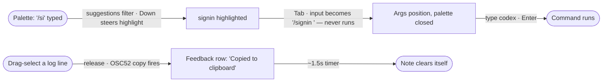

# Happy Paths (MVD)

## Bridge — drive Copilot CLI through a Wisp provider
- **Idea:** Wisp exposes a local OpenAI-compatible endpoint (the **Bridge**) so the GitHub Copilot CLI can run a coding task through any Wisp provider — including a Claude.ai or ChatGPT subscription sign-in.  **Mode:** ux+beat  **Actor:** Wisp user (developer in VS Code)  **Goal:** Copilot CLI completes a task using the user's Claude.ai subscription, no API key.
- **Updated:** 2026-06-23

**Note (pre-spine gate, not on the happy path):** before any of this is built, one
check decides the whole approach — does VS Code pass Wisp's settings to the
Copilot CLI it launches? If yes, the spine above is hands-free. If no, the only
change is *how* step 2→3 wires the settings (user launches VS Code from a shell
that already has them); the journey is otherwise identical.

## Bridge Anthropic door — drive Claude Code through a Wisp provider
- **Idea:** the Bridge grows a second front door speaking Anthropic's Messages protocol, so Claude Code — pointed at it by env vars — runs a coding task on any Wisp provider, headline: the user's ChatGPT-subscription Codex models, no Anthropic API key.  **Mode:** ux+beat  **Actor:** Wisp user (developer in a terminal)  **Goal:** Claude Code completes a task through the Codex provider on the ChatGPT subscription.
- **Updated:** 2026-07-13

```mermaid
flowchart LR
  panel([Wisp side panel — Bridge on]) -->|copy Claude Code snippet · panel renders shell line with address + secret + discovery flag| shell[Terminal with ANTHROPIC_* env set]
  shell -->|launch claude · reads env at startup| session[Claude Code session on the Bridge]
  session -->|/model picker · GET /v1/models lists Wisp providers| picked[Model = 'codex']
  picked -->|type a coding task · POST /v1/messages| working[CLI working — Bridge translates Anthropic <-> Wisp, tools round-trip]
  working -->|Codex provider streams via ChatGPT sign-in · Anthropic SSE back| done([Task done on the ChatGPT subscription])
```

**Note (routing rule, behind the spine):** a `model` naming a Provider id routes
to that provider; an unrecognized `claude-*` string falls back to the **Active
Provider** — the spine never 404s on Claude Code's background-tier calls.

## Bridge Routing map — every Claude name gets its own brain
- **Idea:** a panel-configured **Routing map** (4 fixed Family routes + user-named Aliases, each → a Provider + pinned model) so bridged Claude Code's bare `claude-*` ids and invented names stop collapsing onto the Active Provider — the session runs one model while its subagents and haiku chores run others, simultaneously.  **Mode:** ux+beat  **Actor:** Wisp user (developer running bridged Claude Code)  **Goal:** `/model sol` answers with the pinned Codex model while background haiku calls run the cheap one — in the same session, panel untouched.
- **Updated:** 2026-07-13

```mermaid
flowchart LR
  panel([Wisp side panel — Bridge section]) -->|set Haiku family row · pick Provider + pinned model| family[Haiku → OpenCode Go / cheap model]
  family -->|add Alias 'sol' · pick Codex + gpt-5.6-sol · map saved| mapped[Routing map live]
  mapped -->|in bridged Claude Code type /model sol| named[Session model = 'sol']
  named -->|type a coding task · POST /v1/messages model:'sol'| routed[Bridge: Provider id? no → Alias 'sol' hit → Codex + pinned sol]
  routed -->|meanwhile background call model:'claude-haiku-…' · Family row hit → cheap model| done([Main task on Sol, chores on the cheap pot — one session, two brains])
```

**Note (lookup order, behind the spine):** Provider id → Alias → Family route →
Active Provider; an Alias may not shadow a Provider id (panel refuses), and a
row whose Target is unusable fails loud with the Provider's real error.

## Wisp TUI — install to bridged Claude Code, no VS Code anywhere
- **Idea:** the **Wisp TUI** (ASCII splash + slash-command palette) becomes the face and only config surface of Wisp — a fresh user goes from `npm i -g` to Claude Code answering through their chosen Target without ever opening VS Code; `wisp serve` hosts the Bridge headless, `claude-wisp` launches Claude Code pre-wired.  **Mode:** ux+beat  **Actor:** fresh Wisp user (developer in a terminal)  **Goal:** bridged Claude Code answers through the routed Target on a subscription sign-in — no API key, no VS Code.
- **Updated:** 2026-07-14

```mermaid
flowchart LR
  install([Terminal]) -->|npm i -g wisp-router · platform binary lands, bins wisp + claude-wisp| onpath[wisp on PATH]
  onpath -->|wisp · reads ~/.wisp| splash[Splash — ASCII brand + slash palette]
  splash -->|/signin anthropic · browser OAuth, tokens → auth.json| signed[Provider usable — signed in]
  signed -->|/routing Sonnet → Provider + pinned model · map saved to config| mapped[Routing map live]
  mapped -->|wisp serve · same process, no UI, both doors up| serving[Bridge listening — address + secret shown]
  serving -->|claude-wisp --flags · env set on child only, args passed through| cc[Claude Code session on the Bridge]
  cc -->|coding task · POST /v1/messages → routing map → Target| done([Answer streams through the chosen Target — subscription, no key])
```

**Note (two-face rule, behind the spine):** the VS Code extension is absent
from this spine on purpose — it is the *other* full face (panel + Inquire +
Bridge + native picker; the shrink was cancelled, #66), reading the same
`~/.wisp/` store; a user who also has it installed gets identical Providers
there with zero extra setup.

## Routing CLI + Slot skill — Claude Code launches a subagent on any Target
- **Idea:** new `wisp routing` CLI subcommands (show `--json` / set / unset) let bridged Claude Code itself rebind a sacrificial Family route — the **Slot**, default `haiku` — to any Target, then spawn its Agent tool with that family enum, so a subagent runs on a model Claude Code's fixed enums could never name; a personal Slot skill teaches the dance.  **Mode:** ux+beat  **Actor:** bridged Claude Code (driven by the user asking for a subagent on a specific Target)  **Goal:** the subagent completes its task on the chosen Target; the Slot is restored at session end, never mid-agent.
- **Updated:** 2026-07-16

**Note (live-map rule, behind the spine):** the Bridge reads the Routing map
fresh on every request (ADR-0002), which is what makes the flip take effect
mid-session with zero restarts — and also why restore waits for session end:
restoring while the agent still runs would re-route its next turn. Missing
credentials on the new Target warn at `set` time but never block the write.

## Snapshot commands — the Slot dance with no hand-written lease (2.0.24)
- **Idea:** `wisp snapshot` / `wisp snapshot revert` move the Slot skill's remember-and-restore into Wisp itself — row-based Snapshots of Routing-map rows (families + aliases) kept in `~/.wisp`, so the skill never touches Read/Write file tools; refuse-if-snapshotted replaces the lease-exists stop rule.  **Mode:** ux+beat  **Actor:** bridged Claude Code (slot skill driving the CLI)  **Goal:** subagent runs on the chosen Target; one `revert` puts the family back exactly as it was and clears the Snapshot.
- **Updated:** 2026-07-20

```mermaid
flowchart LR
  ask([User: 'run a subagent on gpt-5.6-sol']) -->|wisp snapshot haiku · current target recorded in ~/.wisp| snapped[haiku Snapshot held — refuses a second until reverted]
  snapped -->|wisp routing set haiku codex/gpt-5.6-sol| bound[haiku → Codex + pinned sol]
  bound -->|Agent tool, model: haiku| agent[Subagent running on Sol]
  agent -->|agent finishes — that family free| freed[haiku's agents done]
  freed -->|wisp snapshot revert haiku · prior written back, prints what it overwrote, entry cleared| restored([Map back as snapshotted — no lease file ever existed])
```

**Note (row independence, behind the spine):** each row snapshots and reverts
alone — parallel Slots revert family-by-family as their agents finish, and
no-arg `wisp snapshot` / `revert` just does every row / every held entry at
once. Rows added *after* a Snapshot are invisible to revert (row-based, the
grill's settled trade-off).

## TUI palette polish — tab-complete + copied indicator (2.0.24)
- **Idea:** two palette-feel fixes — Tab completes the highlighted slash command into the input, and finishing a drag-select flashes a "Copied to clipboard" note in the feedback row.  **Mode:** ux+beat  **Actor:** TUI user  **Goal:** command entered without typing it out; copy confirmed without guessing.
- **Updated:** 2026-07-20

