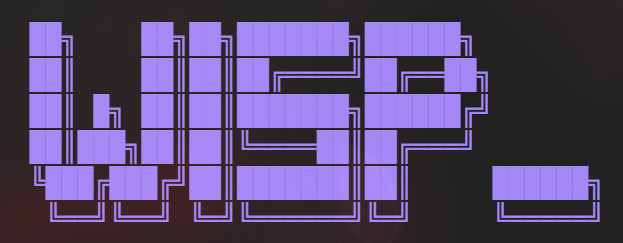
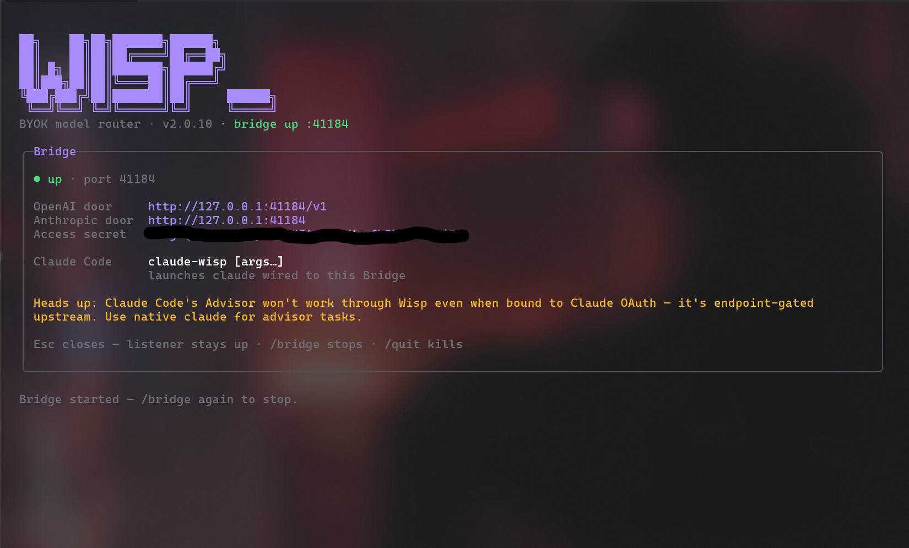
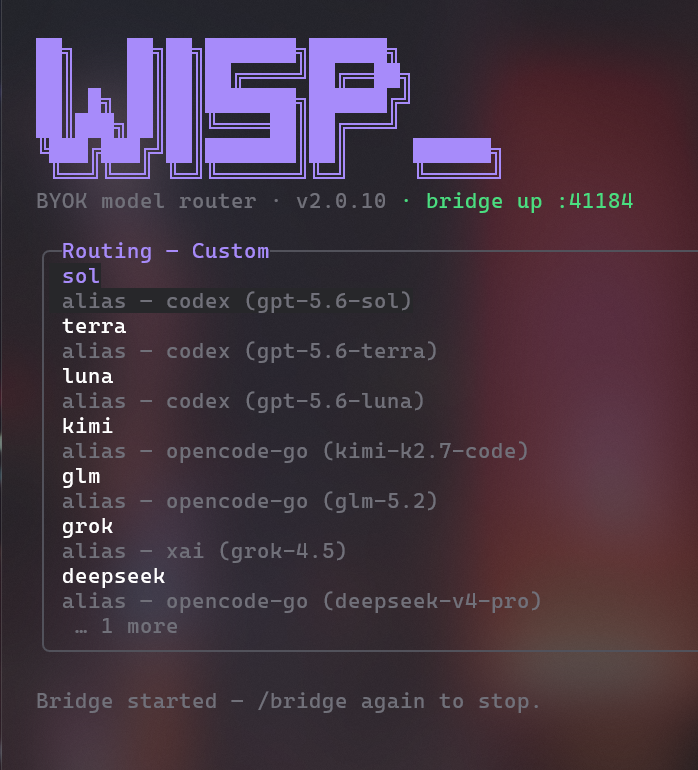
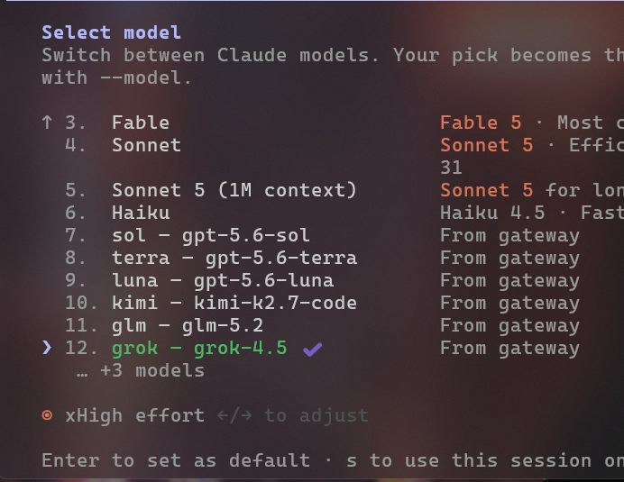
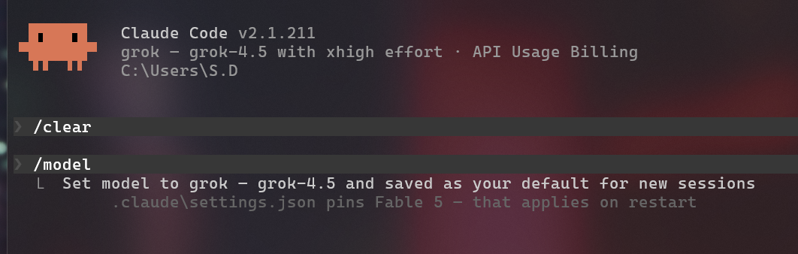

<p align="center">
  
</p>

<p align="center">
  <strong>BYOK model router — run the model access you already pay for, everywhere you code.</strong>
</p>

<p align="center">
  <a href="https://www.npmjs.com/package/wisp-router"></a>
  <a href="https://github.com/EstarinAzx/Wisp-Router/releases"></a>
  
  <a href="LICENSE"></a>
</p>

<p align="center">
  
  
  
  
  
</p>

---

## What is Wisp

Wisp routes your own model backends — your **ChatGPT (Codex) subscription**, your **Claude.ai subscription** (both via OAuth, no API key), or any OpenAI-compatible API key (OpenAI, Groq, Mistral, OpenRouter, Ollama, and more) — into the tools you already code with:

- **VS Code** — providers show up as native models in Copilot's **Chat view**, **Agent mode**, and the **`Ctrl+I`** picker, with streaming, tool calling, vision, and live per-model context windows.
- **Claude Code** — the **Bridge** exposes OpenAI `/v1/chat/completions` and Anthropic `/v1/messages`; `claude-wisp` launches Claude Code already wired to it.
- **Native Codex** — `codex-wisp` uses the `/v1/responses` visible-history subset. Prepared terminal 2.1.5 adds Wisp Aliases beside native picker choices and independent exact model routes; companion VSIX 1.13.8 includes the shared resolver. [Setup, supported tools/content, packaging and limits](docs/codex-wisp.md). Traycer GUI integration remains **NOT VERIFIED**.
- **Terminal** — the **Wisp TUI** manages providers, keys, OAuth sign-ins, and routing, and hosts the Bridge headlessly (`wisp serve`).

The OAuth part is the reason Wisp exists: VS Code's built-in "add a custom model" BYOK stops at static API keys — it can't sign in to a ChatGPT or Claude.ai subscription. Wisp can.

## Bridge in the TUI

`/bridge` starts the local endpoint. OpenAI + Anthropic doors, the generated access secret, and `claude-wisp` to launch Claude Code already wired to it:

<p align="center">
  
</p>

## Routing aliases

Custom aliases pin short names (`sol`, `terra`, `grok`, …) to exact provider+model targets. Edit the map with the **`/routing`** command in the TUI, or non-interactively via the `wisp routing` CLI (`wisp routing` shows the map, `--json` for scripts; `set`/`unset` edit a row). Same list lands in Claude Code's model picker as **From gateway**:

<p align="center">
  
</p>

<p align="center">
  
</p>

<p align="center">
  
</p>

## Codex model discovery

Wisp reads the signed-in Codex account's model catalogue, including new names and variants. The same
metadata supplies reasoning choices, image support and context windows. Discovery refreshes on use
after 15 minutes; the last successful account-specific list is saved for temporary outages.

Use `wisp models codex --refresh`, **Refresh models** in the terminal picker, or the extension's refresh
button to check immediately. Manual model entry remains available. Wisp does not require a Codex CLI
installation: it reads OpenAI's published package version as metadata for the discovery request.

Claude Code's `max` effort passes through as `max` when the selected Codex model supports it; an
unsupported effort uses that model's advertised default. Codex's **Ultra** mode adds multi-agent
orchestration and is not accepted as a Responses reasoning value, so Wisp does not offer it as an effort.

## Install

### TUI + Bridge + Claude Code launcher (npm)

```sh
npm i -g wisp-router   # npm shims require Node.js; compiled binaries need no Bun
wisp                   # the TUI: providers, keys, sign-ins, routing, /bridge
wisp serve             # headless Bridge (no UI, Ctrl+C stops)
claude-wisp            # launch Claude Code routed through the Bridge
```

The 2.1.5 preparation extends `codex-wisp` (`wisp codex-wisp` for a standalone binary) with
picker Aliases and exact native model routes. These routes require a 2.1.5 Bridge or companion
VS Code extension 1.13.8 and an independently installed native Codex CLI. Publication and installation
are separate; existing installations remain unchanged. See the [Codex guide](docs/codex-wisp.md).

### VS Code extension

Not on the Marketplace — download the `.vsix` from [Releases](https://github.com/EstarinAzx/Wisp-Router/releases), then **Extensions → ⋯ → Install from VSIX…**. Full walkthrough (quickstart, providers, Bridge, security) in the [extension README](packages/vscode/README.md).

### Slot skill (Claude Code plugin)

Teaches a bridged Claude Code session to run subagents on any Wisp Target: temporarily rebind a sacrificial Claude family route (the **Slot**), spawn the Agent tool through it, and restore the route safely afterwards — with a lease file guarding against crashes and early restores. Needs wisp-router ≥ 2.0.11 (`wisp routing`). Inside Claude Code:

```
/plugin marketplace add EstarinAzx/Wisp-Router
/plugin install wisp-slot@wisp-router
```

The skill activates when you ask for a subagent on a model the Agent tool cannot name, e.g. "run a subagent on gpt-5.6-sol". Source: [`plugins/slot`](plugins/slot).

## Highlights

- **13 built-in providers + Custom**, in four kinds: API-key (OpenAI-compatible), **Codex** (ChatGPT OAuth, Responses API), **Anthropic** (Claude.ai OAuth, Messages API), and **Grok** (xAI OAuth, Responses API). Grok ≠ the API-key **Groq** row.
- **First-class in the Copilot harness** — streaming, tool calling (which is what makes a model selectable in Agent/Edit modes), vision attachments, a reasoning **Effort** knob, and live context windows from [models.dev](https://models.dev).
- **Bridge** — a local (`127.0.0.1`-only) endpoint guarded by a generated secret, speaking both the OpenAI and Anthropic dialects, so external tools run on your providers.
- **Routing map** — pin Claude Code's `opus` / `sonnet` / `haiku` / `fable` model families to any backend, or invent **aliases** (`/model sol`) pointing at exact provider+model targets; an alias-only mode keeps the `/model` picker clean.
- **Inquire** (VS Code) — inline natural-language code edits: the model returns SEARCH/REPLACE blocks, applied as an accept/reject diff, fail-safe.
- **One shared home** — both faces read `~/.wisp/` (`config.json` + owner-only `auth.json`); keys and tokens never live in VS Code settings.

## Repository layout

Bun-workspaces monorepo — three packages, one root `bun.lock`.

| Package | What |
|---|---|
| [`packages/core`](packages/core) | The engine: Provider catalog, routing map, Bridge protocol + server, OAuth managers and clients, the `~/.wisp` home store. vscode-free, private, never published — each face bundles it at build time. Tests live in [`packages/core/tests`](packages/core/tests). |
| [`packages/vscode`](packages/vscode) | The VS Code extension ([README](packages/vscode/README.md)): native chat provider, side panel (Preact + Tailwind), Inquire, Bridge host. |
| [`packages/tui`](packages/tui) | The Wisp TUI (opentui + React on Bun), headless Bridge, `claude-wisp` and `codex-wisp` launchers. Ships on npm as [`wisp-router`](https://www.npmjs.com/package/wisp-router). |

## Development

```sh
bun install        # root — one lockfile for all packages
bun run test       # 434 Vitest tests (packages/core/tests)
bun run compile    # typecheck + bundle + webview build (packages/vscode)
```

- **Extension:** press **F5** → Extension Development Host (the Wisp icon is in *that* window's activity bar). Package a `.vsix` with `bun run package` in `packages/vscode`.
- **TUI:** `cd packages/tui && bun run dev`. It writes the real `~/.wisp` — set `WISP_HOME` to sandbox.

## Releases

Tag `v<version>` (must equal the version in `packages/tui/package.json`) and push — the `Release` workflow compiles binaries for win32-x64 / darwin-arm64 / darwin-x64 / linux-x64 via `bun build --compile`, attaches them to a GitHub release, and publishes `wisp-router` (thin shell + platform packages, with a GitHub-release download fallback) to npm.
